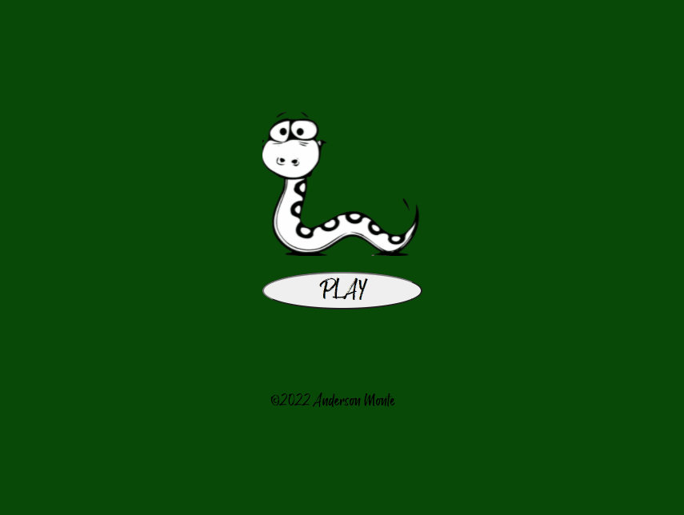

  

<h2 align="center"> Snake Game </h2>

  

  
  
  

## Description

It's a simple snake game. 

## More Infos
With helping from [SparkBox](https://www.youtube.com/watch?v=9a5xfJjZaFE&t=1319s") channel.

You can play the game <a href="https://anderson-monte.github.io/snakegame/" target="_blank">here</a>.
